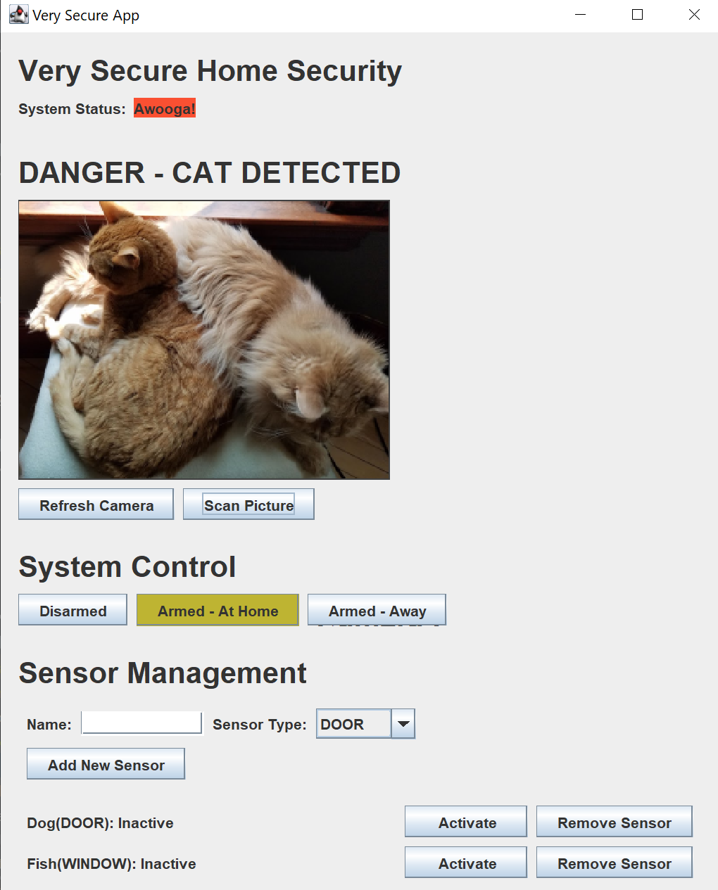
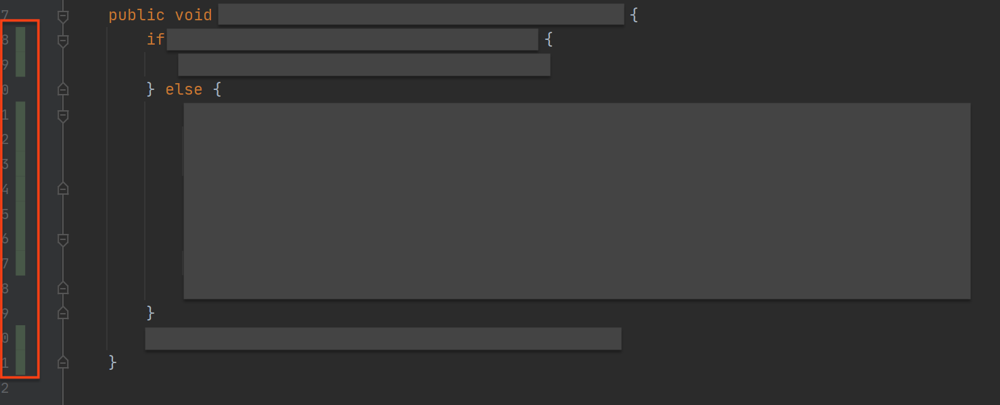

# UdaSecurity

Your company, **Udasecurity**, has created a home security application. This application tracks the status of sensors, monitors camera input, and changes the alarm state of the system based on inputs. Users can arm the system for when they’re home or away as well as disarm the system.

The wild success of your application means that you have to prepare to scale your software. You’ll need to write unit tests for all of the major operations the application performs so that you can safely make more changes in the future. You also need to use maven to streamline the build process and automate your tests and code analysis. More urgently, you need to make sure your application actually does what it’s supposed to do, and so one of writing thorough unit tests will help you find any bugs that already exist.

The image analysis service used by this application has proven popular as well, and another team wants to use it in their project. To accomplish this, you must separate the Image Service from the program and package it as a separate module to be included both in your own project and in other projects.

The end goal for this assignment is to split the project into multiple modules, refactor it to be unit-testable, write unit tests to cover all the main requirements for the Security portion of the application and fix any bugs that you find in the process. You’ll also update the build process to automatically run unit tests, perform static code analysis, and build the code into an executable jar file. 

## Section 1: Update `pom.xml` with Missing Dependencies
This app was initially built by including jar files for each dependency manually, but now we are modernizing the dependency management by using Maven to manage our dependencies and their versions for us. 

The project has already been moved into a maven file structure for you, but you’ll need to identify missing dependencies and add their artifacts to your pom.xml until you can run the project successfully. Look throughout the project directory in order to make sure you find and add all the appropriate dependencies. 

You'll know you've added all of the correct dependencies when the project runs without errors.

## Section 2: Split the Image Service into its Own Project

Now that you have identified all the dependencies and can run the project, it’s time to split things up! Remember another team wants to use the Image Service in their project. To accomplish this, you must separate the Image Service from the program and package it as a separate module to be included both in your own project and in other projects

### Splitting Things Up

1. Use either maven or your IDE to create a new maven project that will be the parent project for the two modules you will be creating. 
1. Inside of the parent project, create one module for your Security Security and one module for your Image service. (*Note: Use one parent pom at the top level and one child pom for each module.*)
1. Move all components into their proper modules.
1. Update dependencies in the poms so that shared dependencies are in the parent pom, but unshared dependencies are in the child poms.
1. Use the pluginManagement tag in the parent pom to set the latest versions for the core plugins used by the maven lifecycle, such as the maven-compiler-plugin.
1. Create a module descriptor for each package. You will have to provide the correct `export` and `requires` statements in each of these descriptors.
1. Address transitive dependencies. Now that your project uses modules, you may need to open your packages to dependencies or explicitly include transitive dependencies that are required by your dependencies that do not declare them all in a `modules-info.java`. *(Note: In particular, some amazon SDK dependencies do not provide modular jars but may require your project to reference the libraries they use. You might need to add **`requires`** statement to your modules-info.java to reference those dependencies. See this discussion thread on modularization of *<a href="https://github.com/aws/aws-sdk-java-v2/issues/1869" target="_blank">*aws 2*</a>*.)*
1. Make sure the project still runs!

## Section 3: Write Unit Tests and Refactor Project to Support Unit Tests

In this section, you will write unit tests for the Security Service. Each of the requirements below should be verified by one or more unit tests. Make sure to put these unit tests in a new package that has the same name as the package containing the Security Service.

You do **NOT** need to test the Image Service or the Repository, so you should use `@Mock`s to help substitute dependencies and keep the scope of each unit test narrow. You should use JUnit 5 features like `@ParameterizedTest` and `ArgumentMatchers` to ensure your tests cover branching conditions.

Each of the requirements below should be verified by one or more unit tests. All of these test the **Security Service**, so make sure your tests don't depend on the implementation of the Repository or the Image Service. *Remember, you can use ****`Mocks`**** to replace these services in your unit tests.*

You should also write interfaces to describe the necessary behaviors of your dependencies to make them easier to Mock. We’re already using a SecurityRepository interface, but we have no interface to describe the behavior of our Image Service. Create an interface that makes it easy to test our application regardless of whether we’re using the `AwsImageService` or `FakeImageService`. 

### *Optional Stand Out Task:* Connect Your Project to the AWS Image Recognition Library

> Once you have created an interface for your image service, complete the steps described in the AwsImageService to create credentials and provide them in a properties file for your application. Change the ImageService implementation class in the CatpointGui class to use the AwsImageService instead of the FakeImageService. Try submitting different types of images and see what comes back!

**While you are writing tests, it's possible you may need to refactor the application in order to make all of the requirements testable.** For example, parts of the business logic may be contained in the GUI or repository classes. You may have to move this logic into the security service to be tested.

Remember, a failing unit test could mean one of two things:

1. Your unit test is faulty.
1. Something in your program isn't working.

Some of these requirements might not be properly implemented, so, even if you write the correct unit test, it might still fail. You will fix any faulty or missing requirements in the next section.

#### Application Requirements to Test:

1. If alarm is armed *and* a sensor becomes activated, put the system into pending alarm status.
1. If alarm is armed *and* a sensor becomes activated *and* the system is already pending alarm, set off the alarm.
1. If pending alarm *and* all sensors are inactive, return to no alarm state.
1. If alarm is active, change in sensor state should not affect the alarm state.
1. If a sensor is activated *while* already active *and* the system is in pending state, change it to alarm state.
1. If a sensor is deactivated *while* already inactive, make no changes to the alarm state.
1. If the camera image contains a cat *while* the system is armed-home, put the system into alarm status.
1. If the camera image does not contain a cat, change the status to no alarm *as long as* the sensors are not active.
1. If the system is disarmed, set the status to no alarm.
1. If the system is armed, reset all sensors to inactive.
1. If the system is armed-home *while* the camera shows a cat, set the alarm status to alarm.

*Reminder*: If you find yourself relying on the behavior of another service, you may want to consider using a Mock!

## Section 4: Fix Any Bugs You Find With Your Unit Tests!
As we stated in the previous section, a failing unit test could mean one of two things:
 1. Your unit test is faulty.
 2. Something in your program isn't working.

Your task is to make sure all of the Application Requirements are properly implemented. Some requirements may not be performed and some bugs may produce unexpected behavior.  After you fix any broken requirements, all of your unit tests should pass!

### Application Requirements to Test:
 1. If alarm is armed _and_ a sensor becomes activated, put the system into pending alarm status.
 2. If alarm is armed _and_ a sensor becomes activated _and_ the system is already pending alarm, set off the alarm.
 3. If pending alarm _and_ all sensors are inactive, return to no alarm state.
 4. If alarm is active, change in sensor state should not affect the alarm state.
 5. If a sensor is activated _while_ already active _and_ the system is in pending state, change it to alarm state.
 6. If a sensor is deactivated _while_ already inactive, make no changes to the alarm state.
 7. If the camera image contains a cat _while_ the system is armed-home, put the system into alarm status.
 8. If the camera image does not contain a cat, change the status to no alarm _as long as_ the sensors are not active.
 9. If the system is disarmed, set the status to no alarm.
 10. If the system is armed, reset all sensors to inactive.
 11. If the system is armed-home _while_ the camera shows a cat, set the alarm status to alarm.

## Section 5: Check Unit Test Coverage
Use IntelliJ to check code coverage. Our goal is to cover everything in the Security Service. Other teams will be maintaining our Image Service so we’ll focus strictly on the behavior of the Security Service. 

**Your goal is to provide full coverage of all methods that implement the application requirements.** You don’t need to test trivial methods like getters or setters, but you do need to make sure that all the lines in your other methods are reachable by the unit tests.

### *Optional Stand Out Task:* Integration Tests

> Create a FakeSecurityRepository class that works just like the `PretendDatabaseSecurityRepository` class (except without the property files). Create a second test class called `SecurityServiceIntegrationTest.java` and write methods that test our requirements as integration tests.

> These tests can call service methods and then use JUnit Assertions to verify that the values you retrieve after performing operations are the expected values.

## Section 6: Build the Application into an Executable JAR
Update your `pom.xml` to use a maven plugin that allows you to compile your application into an executable JAR. Confirm that you can run the program by running the jar file. Execute the Maven goal that builds the JAR and start the application from the command line.

Submit a screenshot titled `executable_jar.png` that shows you running the executable jar from the command line and the application launching. Use the command `java -jar [yourjarname]` to run it.

## Section 7: Add Static Analysis to Build
Add a Reporting tag to your pom that contains the `spotbugs-maven-plugin` and use it to generate a `spotbugs.html` report in your project’s `/target/site` directory. 

You should fix any of the errors it finds that are High priority. You are welcome, though not required, to address any other errors you find as well!

### Project Submission

For your submission, please submit the following:
- Completed project code should be uploaded either to GitHub or a .zip file. Make sure to include the entire project folder.

### Double-Check the Rubric
Make sure you have completed all the rubric items [here](https://review.udacity.com/#!/rubrics/3010/view).

### Submit your Project

You can submit your project by uploading a zip file or selecting your GitHub repo.

